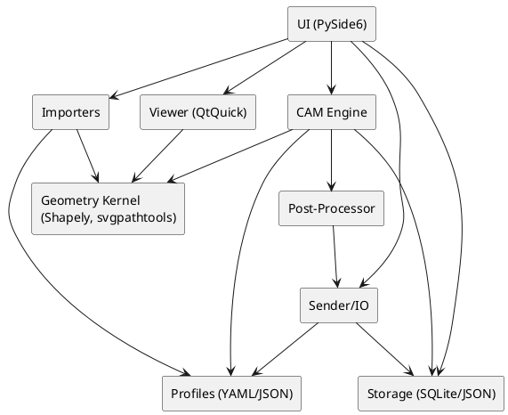

# Method

## Architecture
- Frontend (PySide6/Qt Quick viewer, inspectors, job composer)
- Core Engine (Shapely 2.x, svgpathtools, scikit-image, potracer; importers; CAM; panelization; post-processors; optimizers)
- Sender (asyncio, pyserial/TCP; 4 devices; parsers; flow control)
- Persistence (JSON project; SQLite height maps/history; YAML/JSON profiles)

## Component Diagram (PlantUML)

## Data Model
- Project JSON with layers, panel (`gap.x/y`), CAM ops, autolevel config, machines, post, jobs.
- Machine Profile YAML (controller, envelope, mapping).
- Controller dialect table (GRBL/Marlin/Smoothie/LinuxCNC/Mach3/4/FANUC subset/HPGL).

## Algorithms
- Isolation routing (multi-offset), raster/hatch, drilling/peck, outline & tabs, panelization, toolpath optimization, auto-leveling (bilinear/IDW/RBF), sender concurrency (asyncio).
